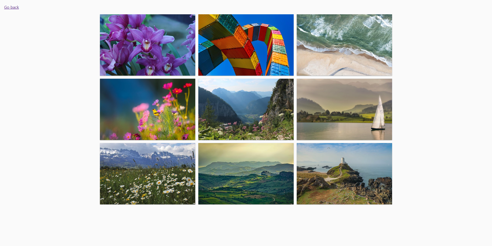
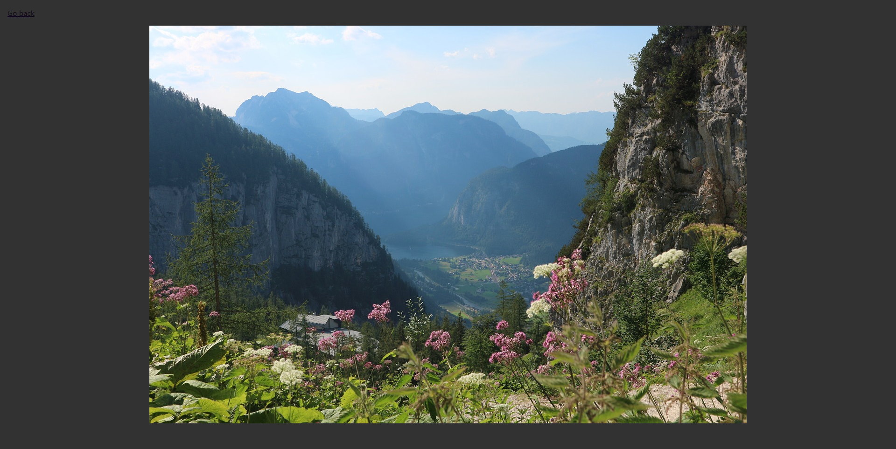
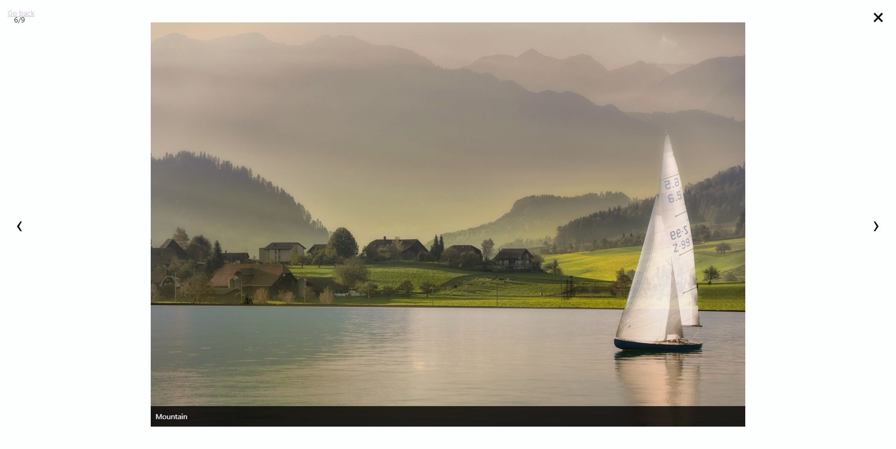

# goit-js-hw-07

Two options for viewing the picture gallery have been created.

## The first option with the possibility of clicking on its elements and viewing the full-size image in a modal window.

## The second option is created using the [SimpleLightbox](https://simplelightbox.com/) library, which handles clicking on images, opening and closing a modal window, and scrolling through images using the keyboard.

